# Medical Slide Templates

学会発表・抄読会・症例報告・教育講演のための医学スライドテンプレート集。

国際学会（AHA/ASCO/ASH）のスピーカーガイドラインと、PLoS Computational Biology "Ten Simple Rules for Effective Presentation Slides" に基づいてデザインした、医師のための実用テンプレート。

HTML + CSS + JavaScript で構成されており、ブラウザで即プレビュー可能。Claude Code のスキルとしても動作する。

## スクリーンショット

### タイトル / COI開示
<p>
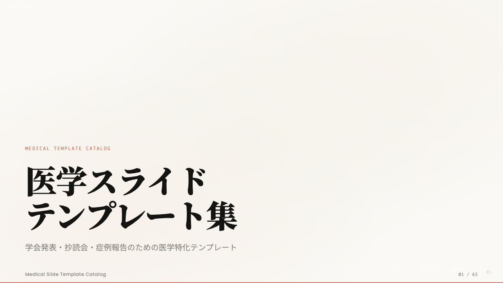 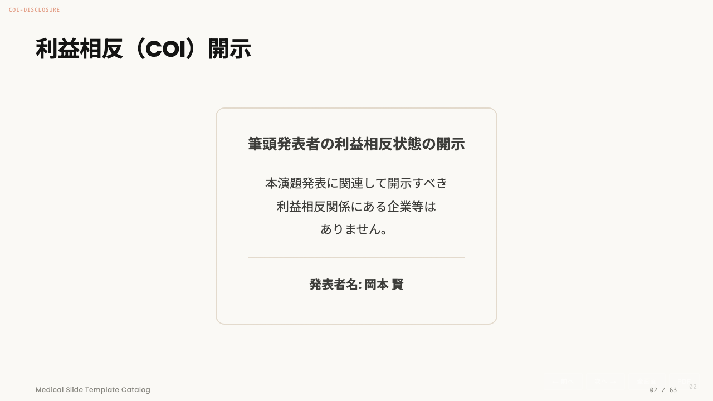
</p>

### 学会口演（CONSORT / Forest Plot / Kaplan-Meier）
<p>
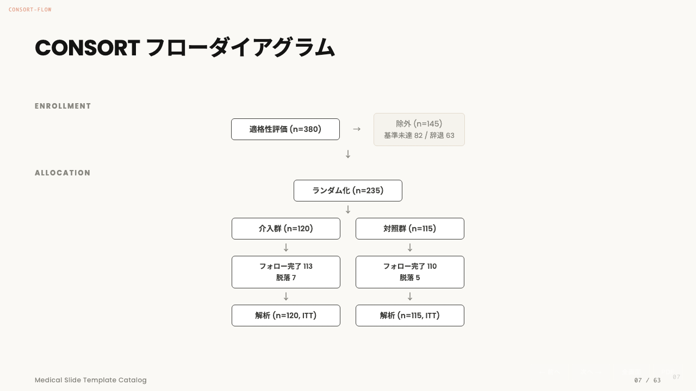 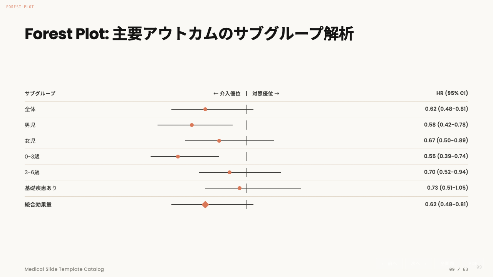 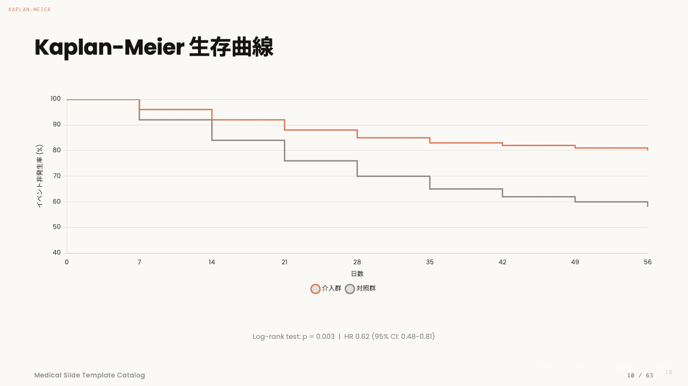
</p>

### 学会口演（Table 1 / PRISMA）
<p>
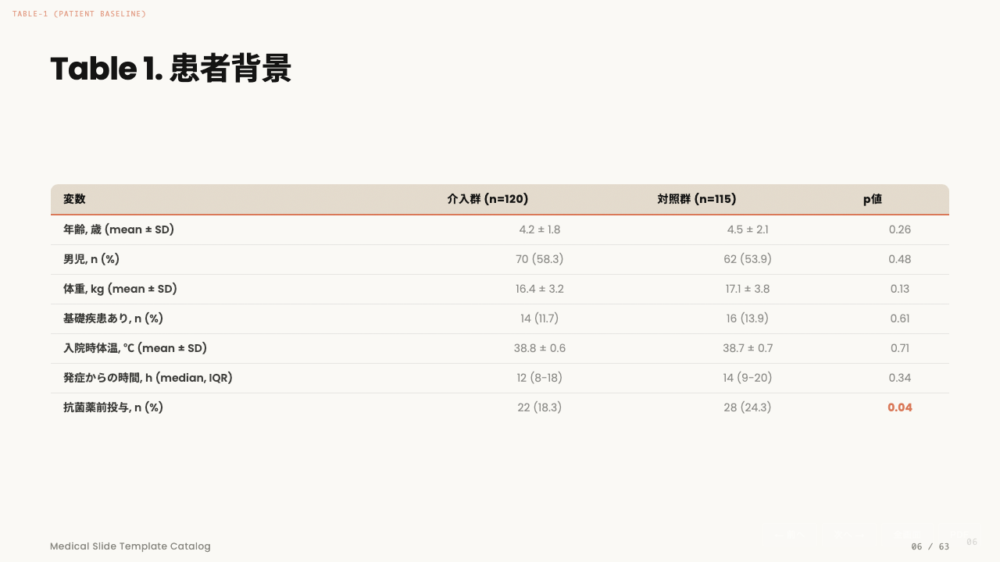 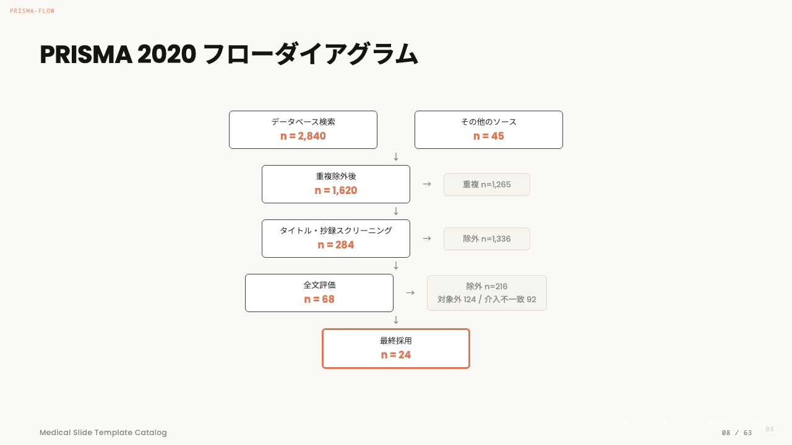
</p>

### 抄読会（PICO / バイアスリスク RoB2）
<p>
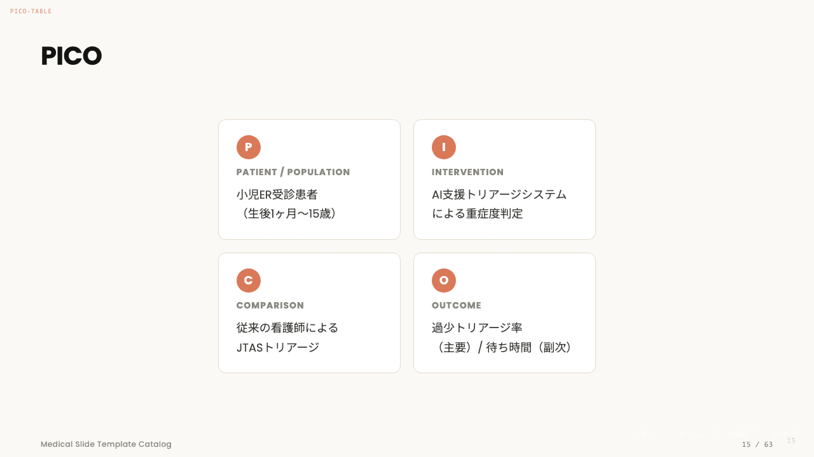 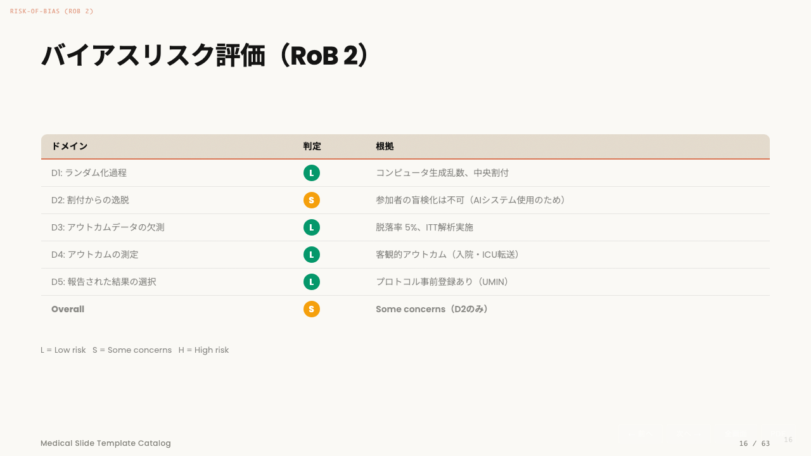
</p>

### 症例報告（バイタル / 検査値 / 鑑別診断 / 臨床経過図）
<p>
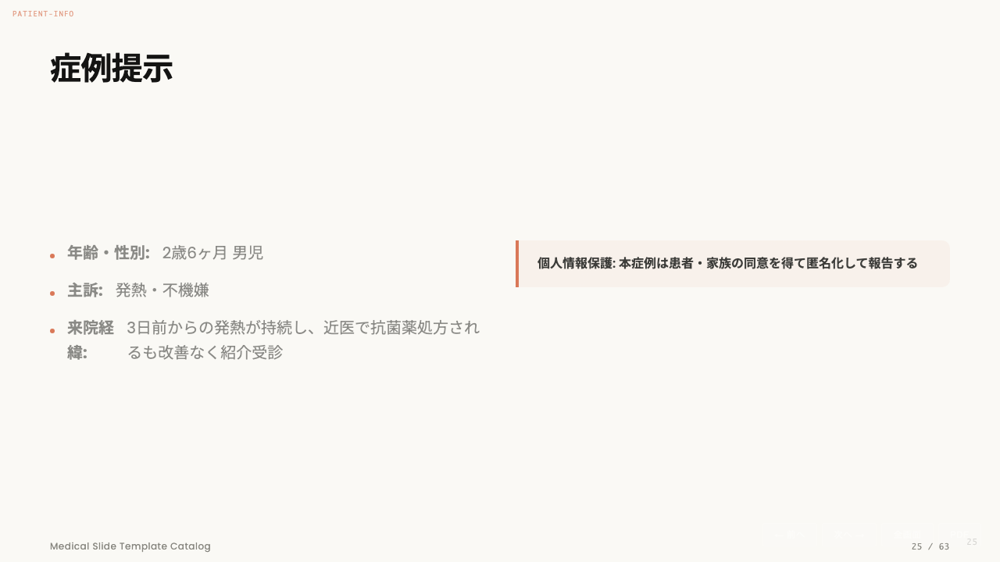 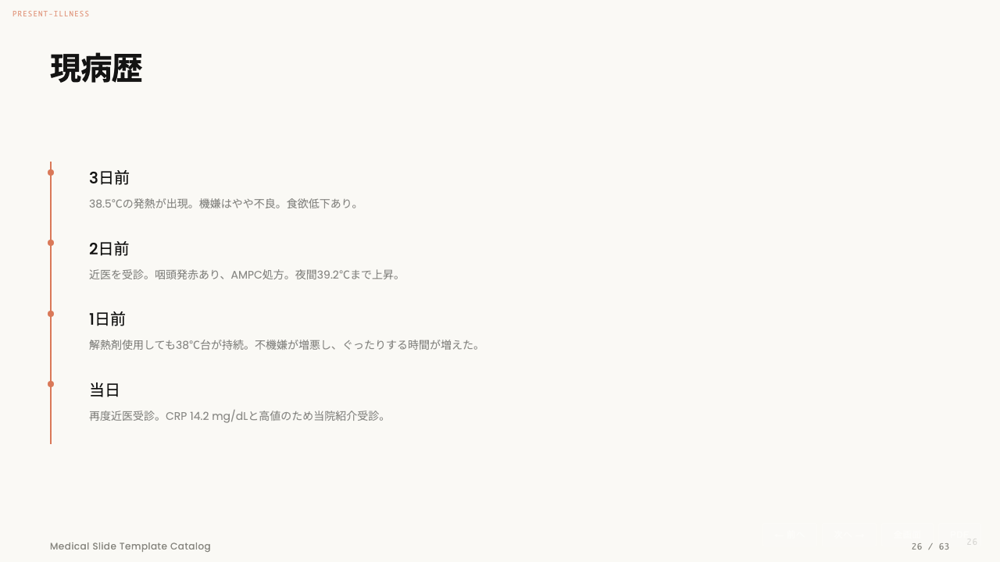
</p>
<p>
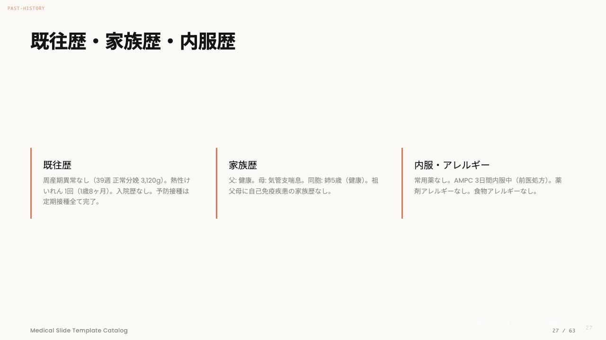 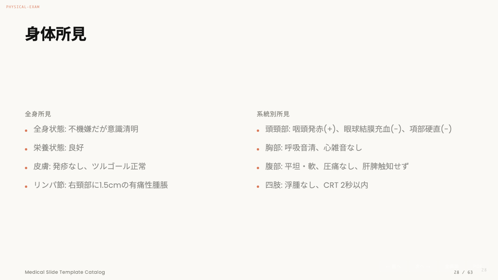
</p>

### 教育講演（クイズ / 診断アルゴリズム）
<p>
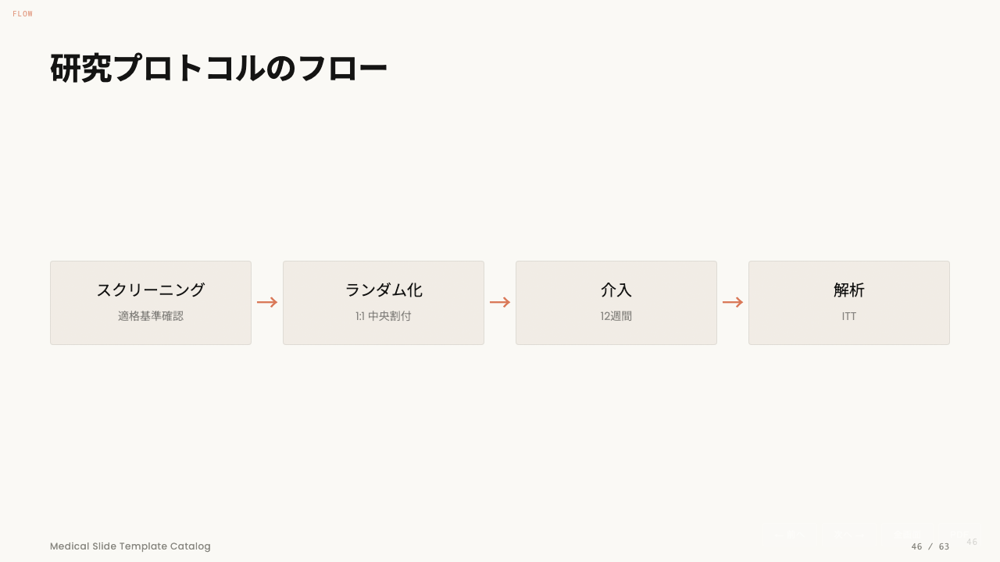 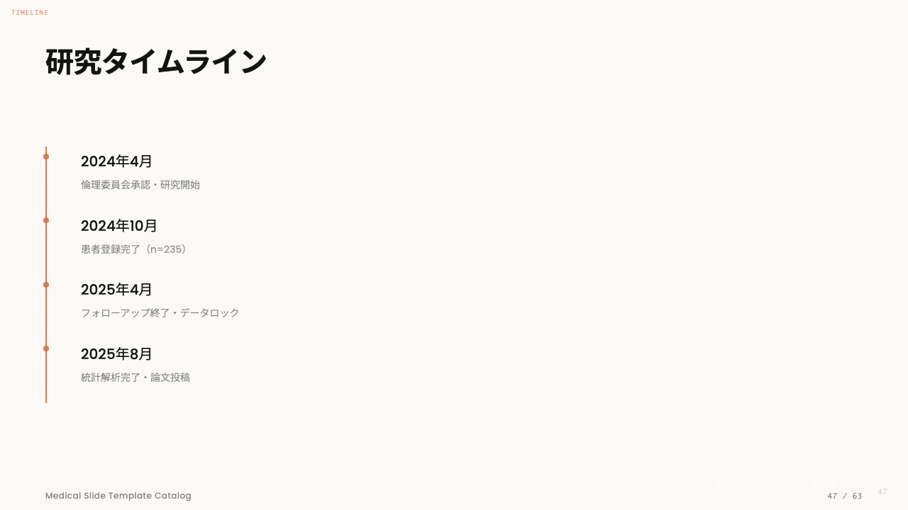
</p>

## なぜ作ったか

医学発表のスライドには、一般的なプレゼンテーションにはない独自の要素がある。COI開示、倫理審査情報、CONSORT図、Forest Plot、PRISMA図、Kaplan-Meier曲線、PICO表、バイアスリスク評価、GRADE、臨床経過図。これらは学会や抄読会で毎回必要になるのに、テンプレートとして整備されたものがほとんどない。

このプロジェクトは、医学発表で「このスライドがないと困る」テンプレートを63種類網羅し、どの発表パターンでも100%の網羅率を達成することを目指した。

## プレビュー

ブラウザで開いて矢印キーで全63枚を確認できる:

```bash
open decks/medical-template-catalog/index.html
```

## テンプレート一覧（63枚）

### 共通（4枚）
規制・倫理系のスライド。学会発表では必須。

| テンプレート | 用途 |
|-------------|------|
| `slide-title` | タイトル（演題名・著者・所属） |
| `coi-disclosure` | COI開示（なし / あり の2パターン） |
| `ethics-approval` | 倫理審査情報（IRB承認番号・同意取得） |

### 学会口演（13枚）
RCT・観察研究・SR/MA・診断精度研究の結果発表に対応。

| テンプレート | 用途 |
|-------------|------|
| `table-1` | 患者背景テーブル（mean±SD, n(%), p値） |
| `consort-flow` | CONSORT フローダイアグラム（RCT） |
| `prisma-flow` | PRISMA 2020 フローダイアグラム（SR/MA） |
| `forest-plot` | Forest Plot（サブグループ解析、HR+95%CI） |
| `kaplan-meier` | Kaplan-Meier 生存曲線（Chart.js、Number at Risk付き） |
| `roc-curve` | ROC曲線 + 診断性能指標（AUC, 感度, 特異度） |
| `confusion-matrix` | 2x2混同行列 + 診断指標一覧（感度, 特異度, PPV, NPV, LR+, LR-） |
| `inclusion-exclusion` | 選択基準・除外基準（2カラム） |
| `study-design` | 研究デザイン概要図 |
| `statistical-methods` | 統計手法サマリー（3カード） |
| `subgroup-table` | サブグループ解析テーブル |
| `outcome-summary` | 主要・副次アウトカムの一覧テーブル |
| `acknowledgments` | 謝辞・Funding・共同研究者 |

### 抄読会（10枚）
Journal Clubでの論文批判的吟味に必要な全スライド。

| テンプレート | 用途 |
|-------------|------|
| `bibliography-card` | 論文書誌カード（雑誌名, IF, DOI, 著者） |
| `pico-table` | PICO表（2x2グリッド） |
| `risk-of-bias` | バイアスリスク評価 RoB 2（Traffic Light表示） |
| `grade-assessment` | GRADEエビデンスプロファイル |
| `strengths-limitations` | Strengths & Limitations（2カラム、緑/赤） |
| `discussion-points` | ディスカッションポイント（質問3つ） |
| `structured-abstract` | 構造化抄録（Background/Methods/Results/Conclusions） |
| `clinical-bottom-line` | Clinical Bottom Line + NNT/NNH/ARR |
| `casp-checklist` | CASPチェックリスト RCT用（11項目、2カラム） |
| `evidence-summary` | エビデンスサマリーテーブル（複数研究比較） |

### 症例報告（15枚）
典型的な症例カンファレンスからICU重症例まで対応。

| テンプレート | 用途 |
|-------------|------|
| `patient-info` | 症例提示（年齢・性別・主訴・来院経緯） |
| `present-illness` | 現病歴（タイムライン形式） |
| `past-history` | 既往歴・家族歴・内服歴（3カラム） |
| `physical-exam` | 身体所見（全身/系統別 2カラム） |
| `vital-signs` | バイタルサイン（6宮格、異常値赤表示） |
| `lab-results` | 検査値テーブル（異常値ハイライト、基準範囲併記） |
| `image-annotation` | 画像所見（CT/MRI/X線 + アノテーション） |
| `differential-diagnosis` | 鑑別診断テーブル（支持所見:緑 / 否定所見:赤） |
| `clinical-course` | 臨床経過図（体温+薬剤バー+イベントの3段構成） |
| `problem-list` | Problem List（Active / Inactive 2カラム） |
| `medication-timeline` | 薬剤投与タイムライン（ガント形式、色分け） |
| `confusion-matrix` | 2x2混同行列 + 診断指標 |
| `ventilator-settings` | 人工呼吸器設定の経時変化（モード/FiO2/PEEP/P-F比） |

### 教育講演（7枚）
参加型レクチャー、ガイドライン解説、臨床推論セッション向け。

| テンプレート | 用途 |
|-------------|------|
| `learning-objectives` | 学習目標（番号付きリスト） |
| `key-definitions` | 重要用語の定義（2x2カード） |
| `quiz` | クイズスライド（臨床シナリオ + 選択肢A-D） |
| `diagnostic-algorithm` | 診断アルゴリズム（分岐フローチャート） |
| `treatment-algorithm` | 治療アルゴリズム（3分岐フロー） |
| `guideline-comparison` | ガイドライン比較表（日本/AAP/NICE） |

### 臨床試験プロット（3枚）
腫瘍学・臨床試験での特殊な可視化。

| テンプレート | 用途 |
|-------------|------|
| `waterfall-plot` | Waterfall Plot（腫瘍縮小率、Chart.js） |
| `swimmer-plot` | Swimmer Plot（患者別治療期間 + イベントマーカー） |
| `funnel-plot` | Funnel Plot（出版バイアス評価、Chart.js） |

### 汎用（8枚）

| テンプレート | 用途 |
|-------------|------|
| `take-home-message` | キーメッセージ（大きな1文） |
| `flow` | フローチャート（横型） |
| `timeline` | タイムライン |
| `gantt` | ガントチャート（研究スケジュール） |
| `before-after` | Before / After 比較 |
| `stat` | 統計数値（3カード） |
| `references` | 参考文献リスト |
| `slide-end` | 締めスライド |

## 対応する発表パターン

10パターンの発表シナリオでテストし、全て100%の網羅率を達成。

| パターン | 想定時間 | 網羅率 |
|---------|---------|--------|
| 学会口演（RCT） | 7-10分 | 100% |
| 学会口演（SR/メタアナリシス） | 7-10分 | 100% |
| 学会口演（診断精度研究） | 7-10分 | 100% |
| 学会口演（観察研究/コホート） | 7-10分 | 100% |
| 抄読会（RCT論文） | 20-30分 | 100% |
| 抄読会（SR/MA論文） | 20-30分 | 100% |
| 症例報告（典型的な症例） | 10-15分 | 100% |
| 症例報告（ICU重症例） | 10-15分 | 100% |
| 教育講演 | 30-60分 | 100% |
| 臨床試験結果報告（腫瘍学） | 10分 | 100% |

## デザイン原則

国際学会ガイドライン（AHA/ASCO/ASH）と学術論文（Naegle KM, PLoS Comp Biol 2021）に基づく。

### 情報密度
- **1スライド = 1メッセージ**
- **1枚/分** を目安にスライド枚数を設計
- テキスト要素は6個以下（Rule of Six）

### フォントサイズ
| 要素 | サイズ |
|------|--------|
| スライドタイトル (h1) | 36-42px |
| 見出し (h2) | 28-32px |
| 本文テキスト | 16-22px |
| テーブルセル | 14-16px |
| ラベル・キャプション | 13-14px |
| 出典・注釈 | 13px |

### カラー
| 用途 | 色 | Hex |
|------|-----|-----|
| 背景 | Ivory Light | `#faf9f5` |
| テキスト | Slate Medium | `#3d3d3a` |
| アクセント | Clay | `#d97757` |
| テーブルヘッダー背景 | Oat | `#e3dacc` |
| 異常値（高値） | Red | `#dc2626` |
| 異常値（低値） | Blue | `#2563eb` |
| 正常・改善 | Green | `#059669` |

### 厳守ルール
- 赤-緑の色の組み合わせは禁止（色覚多様性配慮）
- 3Dグラフは使用禁止
- テーブルヘッダーに黒塗りつぶしは使わない
- Table 1は論文PDFのスクショ貼り付け禁止（再タイプする）
- KM曲線にはNumber at Risk表を必ず付ける
- Forest PlotにはHR=1.0線 + Favors Treatment/Control ラベルを付ける
- COI開示スライドは学会発表で必須（タイトル直後に配置）

## ファイル構成

```
medical-slide-templates/
  README.md                             # このファイル
  SKILL.md                              # スキル定義（ワークフロー+ワイヤーフレーム+ルール）
  LICENSE                               # MIT License
  engine/
    slide.css                           # コアエンジン（16:9ロック, スケーリング, ナビUI）
    slide.js                            # キーボードナビゲーション, PDF出力
  theme/
    anthropic.css                       # Anthropicテーマ（カラーパレット, タイポグラフィ, 図解コンポーネント）
  decks/
    medical-template-catalog/
      index.html                        # テンプレートカタログ（63枚、Chart.js グラフ含む）
```

## 使い方

### 1. プレビューする

```bash
git clone https://github.com/kgraph57/medical-slide-templates.git
cd medical-slide-templates
open decks/medical-template-catalog/index.html
```

矢印キーで全63枚を確認。全画面ボタンで実際のプレゼン表示。

### 2. 自分のスライドを作る

`decks/medical-template-catalog/index.html` からテンプレートのHTMLをコピーして、新しいHTMLファイルに貼り付ける。コンテンツを差し替えるだけ。

```html
<!DOCTYPE html>
<html lang="ja">
<head>
  <meta charset="UTF-8">
  <meta name="viewport" content="width=device-width, initial-scale=1.0">
  <title>My Presentation</title>
  <link rel="stylesheet" href="engine/slide.css">
  <link rel="stylesheet" href="theme/anthropic.css">
  <!-- フォント + Chart.js -->
</head>
<body>
<div class="deck">

  <!-- カタログからテンプレートをコピー&ペースト -->
  <!-- コンテンツを自分の研究内容に差し替え -->

</div>
<script src="engine/slide.js"></script>
</body>
</html>
```

### 3. Claude Code スキルとして使う

```bash
cp SKILL.md ~/.claude/skills/medical-slide/SKILL.md
```

Claude Code で `/medical-slide` と入力すると、ヒアリング→構成選択→HTML生成→最終チェックのワークフローが起動する。

## 技術スタック

- **HTML/CSS/JavaScript** — フレームワーク不要、ブラウザだけで動作
- **Chart.js** — KM曲線, ROC曲線, Waterfall Plot, Funnel Plot のグラフ描画
- **engine/slide.css** — 16:9アスペクト比のロック、レスポンシブスケーリング
- **engine/slide.js** — キーボードナビゲーション（矢印キー）、全画面表示、PDF出力
- **theme/anthropic.css** — Anthropicスタイルのカラーパレット、タイポグラフィ、図解コンポーネント（flow, timeline, pyramid, matrix, venn等）

## 参考文献

- Naegle KM. Ten Simple Rules for Effective Presentation Slides. *PLoS Comput Biol*. 2021;17(12):e1009554.
- AHA Scientific Sessions — Presenter Guidelines
- ASCO Annual Meeting — Oral Presenter Guidelines
- ASH Annual Meeting — Presenter Resources
- PRISMA 2020 Flow Diagram (prisma-statement.org)
- Cochrane Risk of Bias 2 (RoB 2) Tool
- GRADE Working Group (gradeworkinggroup.org)
- CASP Checklists (casp-uk.net)

## ライセンス

MIT License. 自由に使用・改変・再配布できます。

## 作者

岡本 賢 (Ken Okamoto) — 小児科医 / AI×医療
